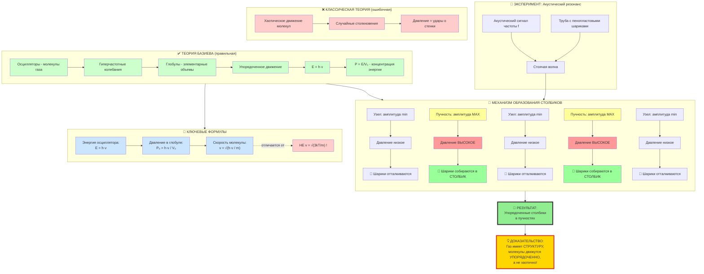

# Схема взаимодействия молекул в акустическом поле

## Стоячая волна и распределение глобул

```mermaid
graph LR
    subgraph Zone1["Узел 1"]
        M1_1((м))
        M1_2((м))
        M1_3((м))
        style M1_1 fill:#e0e0e0
        style M1_2 fill:#e0e0e0
        style M1_3 fill:#e0e0e0
    end
    
    subgraph Zone2["Пучность 1 - СТОЛБИК"]
        M2_1((М))
        M2_2((М))
        M2_3((М))
        M2_4((М))
        M2_5((М))
        S1[🟡]
        S2[🟡]
        S3[🟡]
        style M2_1 fill:#ff6666
        style M2_2 fill:#ff6666
        style M2_3 fill:#ff6666
        style M2_4 fill:#ff6666
        style M2_5 fill:#ff6666
        style S1 fill:#ffff00
        style S2 fill:#ffff00
        style S3 fill:#ffff00
    end
    
    subgraph Zone3["Узел 2"]
        M3_1((м))
        M3_2((м))
        M3_3((м))
        style M3_1 fill:#e0e0e0
        style M3_2 fill:#e0e0e0
        style M3_3 fill:#e0e0e0
    end
    
    subgraph Zone4["Пучность 2 - СТОЛБИК"]
        M4_1((М))
        M4_2((М))
        M4_3((М))
        M4_4((М))
        M4_5((М))
        S4[🟡]
        S5[🟡]
        S6[🟡]
        style M4_1 fill:#ff6666
        style M4_2 fill:#ff6666
        style M4_3 fill:#ff6666
        style M4_4 fill:#ff6666
        style M4_5 fill:#ff6666
        style S4 fill:#ffff00
        style S5 fill:#ffff00
        style S6 fill:#ffff00
    end
    
    Zone1 -->|λ/4| Zone2
    Zone2 -->|λ/4| Zone3
    Zone3 -->|λ/4| Zone4
    
    P1["P низкое<br/>E/V₀ мало"]
    P2["P ВЫСОКОЕ<br/>E/V₀ велико"]
    P3["P низкое<br/>E/V₀ мало"]
    P4["P ВЫСОКОЕ<br/>E/V₀ велико"]
    
    Zone1 -.-> P1
    Zone2 -.-> P2
    Zone3 -.-> P3
    Zone4 -.-> P4
    
    style P1 fill:#ccccff
    style P2 fill:#ff9999
    style P3 fill:#ccccff
    style P4 fill:#ff9999
```

Легенда:
- (м) - молекула с малой амплитудой колебаний (узел)
- (М) - молекула с большой амплитудой колебаний (пучность)
- 🟡 - пенопластовый шарик
- λ - длина волны
